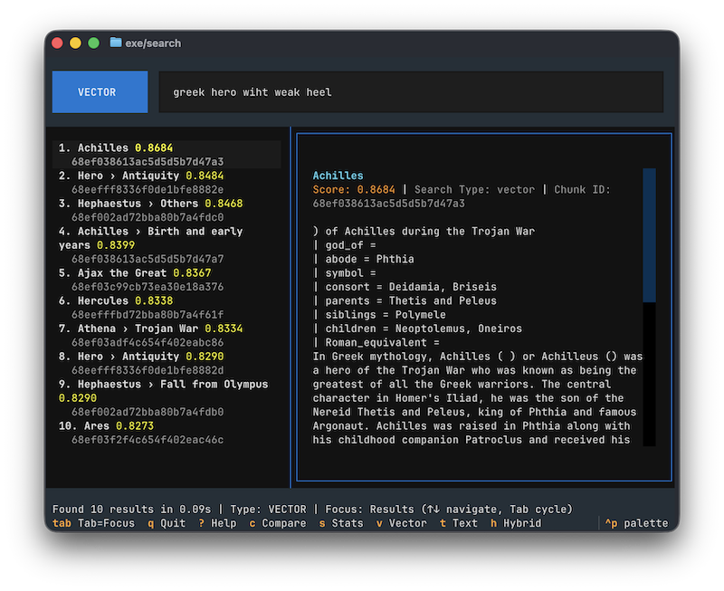

# Wikipedia Vector Search Knowledge Base

A demonstration of [MongoDB 8.2 Community Edition's new search and vector search capabilities](https://www.mongodb.com/company/blog/product-release-announcements/supercharge-self-managed-apps-search-vector-search-capabilities) (public preview). Build a comprehensive vector search-powered knowledge base using Wikipedia articles with MongoDB's native search features - all running locally without MongoDB Atlas.



This project is covered in detail here: [MongoDB Community Edition: Vector Search for Everyone](https://www.ostberg.dev/work/2025/10/12/mongodb-community-vector-search.html)

## 🎯 What This Demonstrates

**MongoDB 8.2 Community Edition** brings search and vector search capabilities previously only available in Atlas to local development and self-managed deployments.

### Key Features

- **Native Vector Search** (`$vectorSearch`) - Semantic search with 768-dimensional embeddings
- **Full-Text Search** (`$search`) - Keyword search with fuzzy matching and relevance scoring
- **Hybrid Search** - Combines vector and text search using RRF or weighted scores
- **Complete Pipeline** - Wikipedia XML parsing, intelligent chunking, local embeddings (LM Studio), and resumable ingestion
- **Interactive TUI** - Terminal interface for testing all search methods with keyboard navigation

## 📋 Requirements

- [uv](https://docs.astral.sh/uv/getting-started/installation/) with Python 3.13+
- Docker and Docker Compose
- **MongoDB Community Server 8.2+** (included in docker-compose.yml)
- **mongot binary** (MongoDB Search Server - included in docker-compose.yml)
- [LM Studio](https://lmstudio.ai/download) with `text-embedding-nomic-embed-text-v1.5@q8_0` model
- Wikipedia XML dump (optional, for data ingestion)

## 🚀 Quick Start

### 1. Setup MongoDB Community Edition 8.2 with Search

```bash
docker compose up -d
```

This starts MongoDB Community Server 8.2 (port 27017), mongot search server (ports 27028, 9946), and initializes a replica set.

### 2. Setup LM Studio

1. Download and install [LM Studio](https://lmstudio.ai/)
2. In LM Studio, download the model: `text-embedding-nomic-embed-text-v1.5@q8_0`
3. Start the local server (default: `http://localhost:1234`)
4. Load the embedding model in LM Studio

### 3. Install Python Dependencies

```bash
uv sync
```

### 4. Download Wikipedia Data

```bash
mkdir -p data
curl -o data/enwiki-latest-pages-articles-multistream.xml.bz2 \
  https://dumps.wikimedia.org/enwiki/latest/enwiki-latest-pages-articles-multistream.xml.bz2
```

**Note:** The compressed file (~20GB) doesn't need extraction - the parser handles `.bz2` files directly.

### 5. Configuration

Edit `config/config.yaml` to point to your Wikipedia dump:

```yaml
wikipedia:
  xml_path: "./data/enwiki-latest-pages-articles-multistream.xml.bz2"

mongodb:
  uri: "mongodb://localhost:27017/?directConnection=true"
  database: "wikipedia_kb"

embedding:
  model: "text-embedding-nomic-embed-text-v1.5@q8_0"
  lmstudio_url: "http://localhost:1234"
  dimension: 768
```

### 6. Ingest Wikipedia Data

```bash
# Start with 100 articles (recommended for testing)
./exe/ingest --max-articles 100
```

See [Scripts Usage](#scripts-usage) below for all ingestion options and examples.

### 7. Run Interactive Search TUI

```bash
./exe/search
```

See [Scripts Usage](#scripts-usage) below for all keyboard shortcuts and features.

## Scripts Usage

### `exe/ingest`

Ingests Wikipedia articles into MongoDB with embeddings.

**Usage:**
```bash
./exe/ingest [OPTIONS]
```

**Options:**
- `--xml-file PATH` - Path to Wikipedia XML dump (default: `./data/enwiki-latest-pages-articles-multistream.xml.bz2`)
- `--max-articles N` - Maximum number of articles to process
- `--resume` - Resume from last checkpoint
- `--clean` - Clean database before ingesting (WARNING: deletes all data)
- `--checkpoint-interval N` - Save checkpoint every N articles (default: 50)
- `--no-cache` - Disable embedding cache
- `--verbose`, `-v` - Enable verbose logging

**Examples:**
```bash
# Start fresh with 100 articles
./exe/ingest --clean --max-articles 100

# Resume previous ingestion
./exe/ingest --resume

# Custom checkpoint interval
./exe/ingest --max-articles 500 --checkpoint-interval 100

# Specify custom XML file location
./exe/ingest \
  --xml-file ./data/enwiki-latest-pages-articles-multistream.xml.bz2 \
  --max-articles 100
```

### `exe/search`

Interactive TUI (Terminal User Interface) for searching the Wikipedia knowledge base. Built with [Textual](https://textual.textualize.io/), provides an htop-like interface with keyboard navigation.

**Usage:**
```bash
./exe/search
```

**Key Features:**
- Three-pane layout: search input, results list, detail pane
- Arrow key navigation (↑/↓) through results
- Multiple search methods (Vector, Text, Hybrid)
- Side-by-side comparison of all search methods
- Auto-updating detail pane when navigating results
- Database statistics display
- Built-in help system with keyboard shortcuts

**Keyboard Shortcuts:**
```
v         - Vector search mode
t         - Text search mode
h         - Hybrid search mode
c         - Compare all search methods
s         - Show database statistics
Tab       - Cycle focus (Input → Results → Detail)
↑/↓       - Navigate results or scroll detail pane
Enter     - Submit search
?         - Show help
q         - Quit
```

**Example Workflow:**
- Type query: `How does photosynthesis work?`
- Press `v` for vector search, `t` for text search, or `h` for hybrid search
- Use `Tab` to cycle focus between input, results, and detail panes
- Navigate results with `↑/↓` arrow keys
- Press `c` to compare all three search methods side-by-side
- Press `s` to view database statistics

## 📊 Architecture

Complete local AI-powered search stack:

```
Wikipedia XML Dump (.xml.bz2)
    ↓
Parser (extract articles)
    ↓
Text Processor (clean, chunk)
    ↓
Embedding Generator (LM Studio)
    ↓
MongoDB Community 8.2 + mongot
├── Vector Search ($vectorSearch)
├── Full-Text Search ($search)
└── Hybrid Search (Combined)
    ↓
Interactive Demo CLI
```

## 🧪 Testing

```bash
# Run all tests
uv run pytest

# Linting
uv run ruff check src/ tests/ scripts/
```

## 🔧 Components

### 1. WikiXMLParser (`wiki_parser.py`)
- Streams Wikipedia XML dumps
- Filters redirects and disambiguation pages
- Cleans wiki markup
- Handles compressed .bz2 files

### 2. TextProcessor (`text_processor.py`)
- Multiple chunking strategies:
  - **Semantic**: Preserves paragraphs/sections
  - **Fixed**: Fixed token count with overlap
  - **Hybrid**: Combines both approaches
- Token counting with tiktoken
- Maintains context (title, section headers)

### 3. EmbeddingGenerator (`embedding_service.py`)
- LM Studio API integration via `lmstudio` Python package
- Uses `text-embedding-nomic-embed-text-v1.5@q8_0` model (768 dimensions)
- Batch processing with progress tracking
- File-based embedding cache for efficiency
- Automatic retry with exponential backoff
- Dimension validation

### 4. MongoDBManager (`mongodb_manager.py`)
- Connection management
- Collection and index setup
- Bulk insert operations
- Vector and text search indexes
- Statistics and monitoring

### 5. IngestionPipeline (`ingest_pipeline.py`)
- Orchestrates: parse → chunk → embed → store
- Batch processing for efficiency
- Checkpointing for resumability
- Progress tracking and statistics
- Error handling and recovery

### 6. SearchService (`search_service.py`)
- Vector search using MongoDB's native `$vectorSearch` aggregation stage
- Text search using MongoDB's native `$search` with fuzzy matching
- Hybrid search (RRF and weighted algorithms)
- Score normalization
- Result deduplication

## 🎓 Search Algorithms

### Vector Search
Uses MongoDB's native `$vectorSearch` aggregation stage to find semantically similar content based on embedding cosine similarity.

### Text Search
Uses MongoDB's native `$search` aggregation stage with text indexes and optional fuzzy matching for keyword-based retrieval.

### Hybrid Search

**RRF (Reciprocal Rank Fusion)**:
```
score = 1 / (k + rank)
```
Combines ranked lists fairly without needing score normalization.

**Weighted Score**:
```
final_score = α × normalized_vector_score + β × normalized_text_score
```
Where α + β = 1.0 (default: 0.6 vector + 0.4 text)

